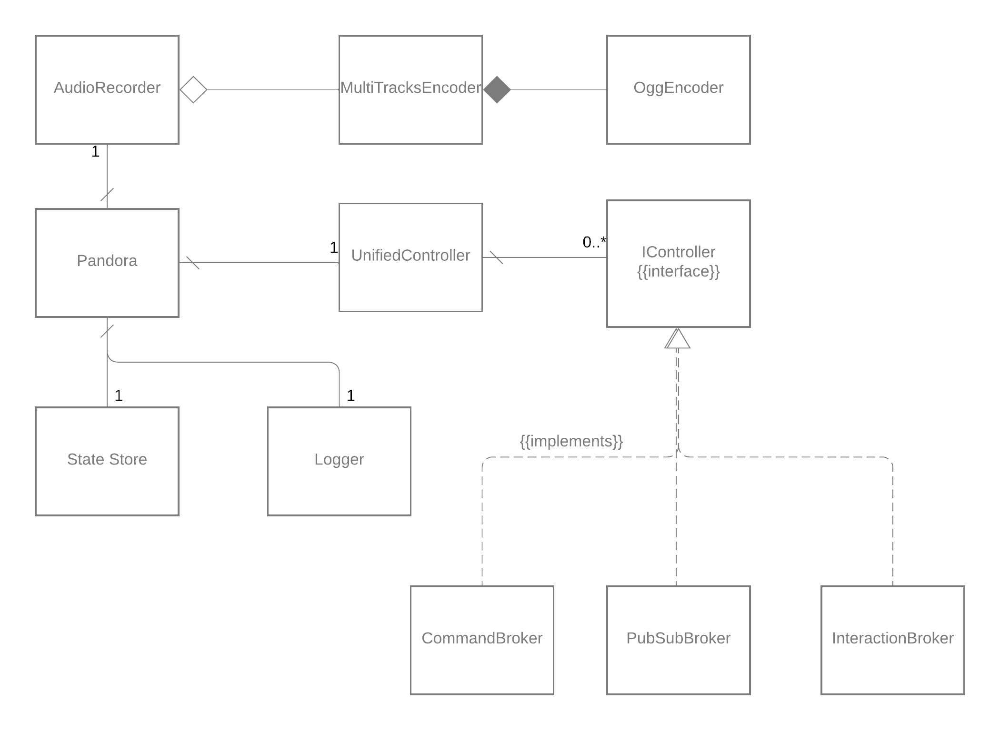

# Pandora: Discord recorder


[](https://codecov.io/gh/SoTrxII/Pandora)
[](https://hub.docker.com/r/sotrx/pandora/)

Pandora is a multi-track Discord voice recorder written in Typescript. This project should actually be considered as a
partial fork of [Yahweasel's Craig](https://github.com/CraigChat/craig), as the recording process is pretty much the
same. Initially, I just needed to add some workflow changes to Craig, but plain Javascript wasn't that convenient to
work with, and I ended up refactoring the whole thing, cherry-picking the functionalities I wanted.

Pandora can be regarded as a simplified version of Craig, intended to be used to record a single voice channel at a time.

This repository contains just the **recording** part, storing raw, unusable data. The cooking part, processing the data
into an audio file (or zip file with multiple tracks) can be found [here](https://github.com/SoTrxII/Pandora-cooking-server).
The two projects are separated to allow for some sort of "horizontal scaling". One cooking server can be used with
multiples bots (or multiple shards).
The number of cooking servers can then be increased along with the workload.

## Usage

There are three ways to use Pandora. Using text-based commands, interactions, or pub/sub messages
component to begin/end the recording. See [configuration section](#configuration).

### Commands

```bash
# You can configure the command prefix, see "configuration" section
# Start a recording session
<COMMAND_PREFIX>record

# End a recording session
<COMMAND_PREFIX>end
```

### Interactions

```bash
# Start a recording session
/record

# End a recording session
/end
```

### Pub/Sub

The pub/sub communication is using the [Request/Reply](https://www.enterpriseintegrationpatterns.com/RequestReply.html) pattern.
The pub/sub component itself can be any valid [Dapr pub/sub component](https://docs.dapr.io/reference/components-reference/supported-pubsub). See [configuration section](#configuration).

Message topics and payloads are as follow :


#### Details

In order to begin a recording session, a message must be published to the topic `startRecordingDiscord`.
This message must contain the ID of the voice channel to record.

```ts
pubsub.publish("startRecordingDiscord", {
  voiceChannelId: "<ID of the voice channel to record>",
});
```

Once the recording started, an acknowledgment will be sent on the topic `startedRecordingDiscord`, echoing the sent payload.

Likewise, to stop recording, a message must be published to the topic `stopRecordingDiscord`. This message can be handled in two ways :

- If the voice channel id is specified in the payload, **only the instance of Pandora currently recording this specific voice channel will stop.**
- If the message has no payload, **all instances of pandora will stop recording**.

This allows for multiple bot instances recording multiple voices channels at the same time to be controlled by the same backing process.

The acknowledgment will be sent on the topic `stoppedRecordingDiscord`.

## Architecture



Pandora uses 5 modules:

- The **audio recorder** itself, capturing RTP packets from Discord and storing the raw OGG packets in a set of text files.
- The **UnifiedController**, an event-based interface to handle how to start/end a recording. So far, the bot can be
  controlled either by text commands, interactions or pub/sub messages.
- An external **state store**. Catching errors from Discord voice connections has always been very tedious,
  this store saves the current recording state and leaves the bot reboot to get a clean state.
- A **logger**. Plain text logging is used in development, [ECS format](https://www.elastic.co/guide/en/ecs/current/index.html) is used in production.
- An **Object Store**. This is to allow for the bot itself to scale, as it removes the need for a shared volume between it and the cooking server

## Configuration

Pandora uses 5 environment variables to control its runtime behaviour.

```dotenv
# Discord bot token
PANDORA_TOKEN=<DISCORD_TOKEN>
# Prefix for text-based command
COMMAND_PREFIX=<COMMAND_PREFIX>
# Dapr components names
PUBSUB_NAME=<DAPR_COMPONENT_PUBSUB>
STORE_NAME=<DAPR_COMPONENT_STORE>
OBJECT_STORE_NAME=<DAPR_COMPONENT_OBJECT_STORE>
# If defined, do not use interactions as a mean to communicate
DISABLE_INTERACTIONS=<ANY_VALUE>
```

#### Dapr

[Dapr](https://github.com/dapr/dapr) is used a decoupling solution. Dapr uses **components** to define the implementation
of some part of the application at runtime using a [sidecar architecture.](https://medium.com/nerd-for-tech/microservice-design-pattern-sidecar-sidekick-pattern-dbcea9bed783)

These components are YAML files mounted in the sidecar as a volume. You can find a sample deployment
using these components in the [sample implementation](#minimal-deployment) section.

## Minimal deployment

There are multiple ways to deploy Pandora. This section will focus on the simplest way and will have the following features :

- Starting / Ending a recording with text commands/interaction
- Retrieve a record with the [cooking server](https://github.com/SoTrxII/Pandora-cooking-server)
- Using the state store, it should be able to reboot and retry if Discord voice connection crashes

I'll explain why you might want to add some components later

This example deployment will use docker-compose, but any orchestrator will do.

First, create in any directory the following hierarchy:

```tree
.
├── components
│   └── state-store.yml
└── docker-compose.yml
```

Then:

- paste this in **./components/statestore**

```yaml
#./components/state-store.yaml
# A sample statestore component using Redis
# as a backend
apiVersion: dapr.io/v1alpha1
kind: Component
metadata:
  name: statestore
spec:
  type: state.redis
  version: v1
  metadata:
    - name: redisHost
      value: redis:6379
    - name: redisPassword
      value: ""
```

- paste this in **docker-compose.yml**, and **fill the <...> variables**

```yaml
version: "3.7"
services:
  # The bot itself, record into raw, unusable files
  pandora:
    image: sotrx/pandora:2.2.0
    container_name: pandora
    restart: always
    environment:
      # Discord bot token
      - PANDORA_TOKEN=<DISCORD_TOKEN>
      # Prefix for text-based command
      - COMMAND_PREFIX=<COMMAND_PREFIX>
      # Dapr component for state storage
      - STORE_NAME=statestore
    volumes:
      - pandora_recordings:/rec
    networks:
      - discord_recordings
  # Dapr sidecar, defining runtime implementations
  pandora-dapr:
    image: "daprio/daprd:edge"
    command:
      [
        "./daprd",
        "-app-id",
        "pandora",
        "-app-port",
        "50051",
        "-dapr-grpc-port",
        "50002",
        "-components-path",
        "/components",
      ]
    # In docker-compose, you have to provide components by sharing a volume
    # this is the dapr/components directory
    volumes:
      - "./components/:/components"
    depends_on:
      - pandora
    network_mode: "service:pandora"

  # Converts the raw files into audio files
  pandora-cooking-server:
    image: sotrx/pandora-cooking-server:2.1.0
    container_name: pandora-cooking-server
    ports:
      - "3004:3004"
    restart: always
    volumes:
      - pandora_recordings:/app/rec
    networks:
      - discord_recordings

  # State store
  redis:
    image: "redis:alpine"
    networks:
      - discord_recordings

# Storing the recordings
volumes:
  pandora_recordings:

# Default docker network doesn't always provide name resolution
# so we create a new one
networks:
  discord_recordings:
```

You can then start the bot with

```
docker-compose up -d
```

Upon starting a recording with either a slash command or a text command,
pandora will emit a message with this format :

```shell
Recording started with id <ID>
```

Once you ended the recording session, you can get the audio files using the exposed port of the cooking server.

Open a browser and type

```
localhost:3004/<ID>
```

to retrieve the recording in the default format (OGG, mixed as a single track)

#### Limitations

This deployment is simple but lack two features :

- Starting / Ending a recording with Pub/Sub
- Using an external object storage solution (such as Amazon S3) to store the recordings. Using a volume prevent the bot/cooking server to be able to scale properly

These more robust deployments are explained in the [deploying](docs/deploying.md) doc.
